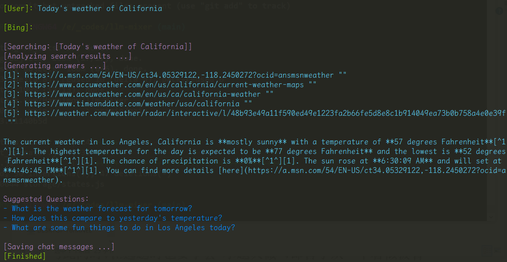

## Bing-Chat-API

A successor to [EdgeGPT](https://github.com/acheong08/EdgeGPT) by [acheong08](https://github.com/acheong08).

**Note: This project is in rapid progress, and currently is not ready to be used in production.**

After completing some key features, I would focus on the quick deployment of this project.

## Install dependencies

```bash
# pipreqs . --force --mode no-pin
pip install -r requirements.txt
```

## Docker Build

```bash
sudo docker build -t bing-chat-api:1.0 . --build-arg http_proxy=$http_proxy --build-arg https_proxy=$https_proxy
```

## Run

Command Line:

```bash
python -m apis.chat_api
```

Docker run:

```bash
# no proxy
sudo docker run -p 22222:22222 bing-chat-api:1.0

# with proxy
sudo docker run -p 22222:22222 --env http_proxy="http://<server>:<port>" bing-chat-api:1.0
```

## Example

Command Line:

