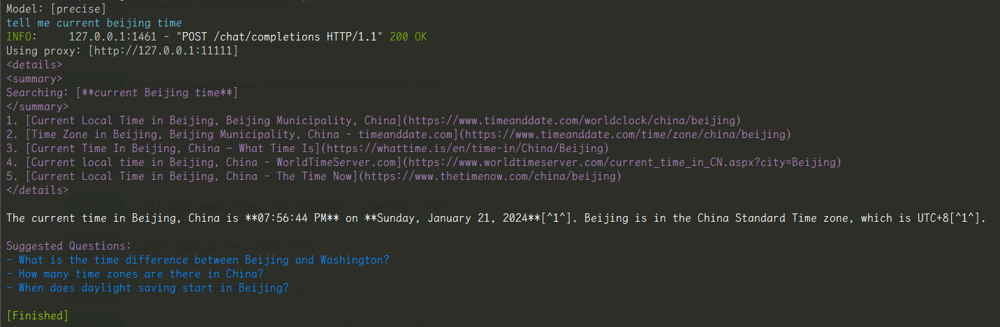

# Bing-Chat-API

Chat with Bing like what you do with OpenAI API.

Project link: https://github.com/Hansimov/bing-chat-api

## Thanks
- [EdgeGPT](https://github.com/acheong08/EdgeGPT) by [@acheong08](https://github.com/acheong08)
- [bingo](https://github.com/weaigc/bingo) by [@weaigc](https://github.com/weaigc)
- [@ninomae](https://github.com/NINOMAE1995)
- [@Harry-zklcdc](https://github.com/Harry-zklcdc)

## Features

✅ Implemented:

- Support all conversation styles in New Bing
  - `precise`, `balanced`, `creative`
- Enable/Disable search
  - Model names suffixed with `offline` are disabling search
  - `precise-offline`, `balanced-offline`, `creative-offline`
- Support OpenAI API format
  - Can use api endpoint via official `openai-python` package
- Support stream response
- Support system prompt
  - This means you could bring Sydney back!
- Support infinite-round chat
  - As long as not exceeded the token limit (~32k)
- Support Docker deployment

🔨 In progress:

- [ ] Enhance performance and reduce session create requests

- [ ] Authentication with API key


## Run API service

### Expected results

After running the API service, you should be able to see the following UI and server logs.

UI of visiting `http://127.0.0.1:22222`:


Server logs of calling `/chat/completions`:



### Run in Command Line

**Install dependencies:**

```bash
# pipreqs . --force --mode no-pin
pip install -r requirements.txt
```

**Run API:**

```bash
# on product mode
python -m apis.chat_api

# on develop mode
python -m apis.chat_api -d

```

## Run via Docker

**Docker build:**

```bash
sudo docker build -t bing-chat-api:1.0 . --build-arg http_proxy=$http_proxy --build-arg https_proxy=$https_proxy
```

**Docker run:**

```bash
# no proxy
sudo docker run -p 22222:22222 bing-chat-api:1.0

# with proxy
sudo docker run -p 22222:22222 --env http_proxy="http://<server>:<port>" bing-chat-api:1.0
```

## API Usage

### Using `openai-python`

See: [`examples/chat_with_openai.py`](https://github.com/Hansimov/bing-chat-api/blob/main/examples/chat_with_openai.py)

```py
from openai import OpenAI

# If runnning this service with proxy, you might need to unset `http(s)_proxy`.
base_url = "http://localhost:22222"
api_key = "sk-xxxxx"
client = OpenAI(base_url=base_url, api_key=api_key)
response = client.chat.completions.create(
    model="precise",
    messages=[
        {
            "role": "user",
            "content": "search california's weather for me",
        }
    ],
    stream=True,
)

for chunk in response:
    if chunk.choices[0].delta.content is not None:
        print(chunk.choices[0].delta.content, end="", flush=True)
    elif chunk.choices[0].finish_reason == "stop":
        print()
    else:
        pass
```

### Using post requests

See: [`examples/chat_with_post.py`](https://github.com/Hansimov/bing-chat-api/blob/main/examples/chat_with_post.py)

```py
import ast
import httpx
import json
import re

# If runnning this service with proxy, you might need to unset `http(s)_proxy`.
chat_api = "http://localhost:22222"
api_key = "sk-xxxxx"
requests_headers = {}

requests_payload = {
    "model": "precise",
    "messages": [
        {
            "role": "user",
            "content": "search and tell me today's weather of california",
        }
    ],
    "stream": True,
}

with httpx.stream(
    "POST",
    chat_api + "/chat/completions",
    headers=requests_headers,
    json=requests_payload,
    timeout=httpx.Timeout(connect=20, read=60, write=20, pool=None),
) as response:
    response_content = ""
    for line in response.iter_lines():
        remove_patterns = [r"^\s*data:\s*", r"^\s*\[DONE\]\s*"]
        for pattern in remove_patterns:
            line = re.sub(pattern, "", line).strip()

        if line:
            try:
                line_data = json.loads(line)
            except Exception as e:
                try:
                    line_data = ast.literal_eval(line)
                except:
                    print(f"Error: {line}")
                    raise e
            delta_data = line_data["choices"][0]["delta"]
            finish_reason = line_data["choices"][0]["finish_reason"]
            if "role" in delta_data:
                role = delta_data["role"]
            if "content" in delta_data:
                delta_content = delta_data["content"]
                response_content += delta_content
                print(delta_content, end="", flush=True)
            if finish_reason == "stop":
                print()
```